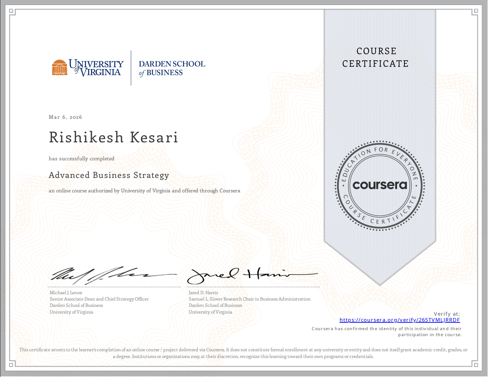

# Advanced Business Strategy Analysis

This repository presents a concise strategic analysis project completed as part of the **Advanced Business Strategy** course by the **University of Virginia**. The work applies core strategy frameworks to evaluate the competitive position of **Finnair** in the global aviation industry.

## Course summary

This course focused on how firms build and defend competitive position over time. It covered strategic analysis across industry change, stakeholder pressures, international expansion, and diversification decisions.

## Core Strategic Analysis Tools
(Main areas covered)

This project applies four key strategy frameworks:

- **Competitive Life Cycle Analysis** – understanding how industries evolve and how firms respond to disruption and competitive pressures  
- **Stakeholder Analysis** – identifying key stakeholders and evaluating their influence on firm strategy  
- **Internationalization Analysis** – assessing how firms expand and compete across global markets  
- **Diversification Analysis** – evaluating how firms create value by expanding into related or new businesses

## Project focus

The main project in this repository analyzes **Finnair** using the above frameworks to assess its competitive position, strategic challenges, and future opportunities.

## What this project demonstrates

- Ability to apply business strategy frameworks to a real company
- Ability to connect market context with firm level strategic choices
- Ability to synthesize findings into a clear competitive positioning assessment
- Ability to present strategic insights in a structured and professional format

## Key insights from the analysis

- Finnair historically benefited from Helsinki’s position as a Europe Asia gateway
- Geopolitical disruption weakened this advantage and forced route restructuring
- The firm remains competitive through hub efficiency, international connectivity, and related diversification in aviation services
- Major pressures include cost competition, environmental regulation, and industry disruption

## What I studied?
In this course I learned how firms build and sustain competitive advantage. I studied how industries evolve over time using competitive life cycle analysis, how stakeholder pressures affect strategic decisions, how companies expand internationally, and how diversification across businesses can create or destroy value. I applied these frameworks in a strategic analysis of Finnair to evaluate its competitive position, opportunities, and risks.

## Files

- `finnair_strategy_report.md`  
  Full report in Markdown format

- `finnair_strategy_report.pdf`  
  Exported report version

- `images/`  
  Supporting figures and exhibits

- `generate_figures.py`  
  Python script used to generate report visuals

## Outcome

This project strengthened practical skills in strategic analysis, competitive positioning, and business framework based decision making.
